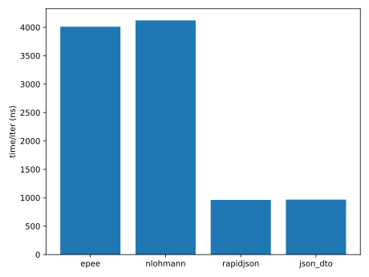
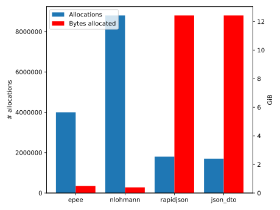

# JSON speed test

In this repository we attempt to compare the (de)serialization performance of
various JSON libraries. Here, we test the following json serialization
libraries:

- [epee](https://github.com/hyle-team/epee), the library currently in use by
  [Monero project](https://github.com/monero-project/monero/). Serialization
  is intrusive (part of the actual struct) and heavily macro based. It is
  theoretically header-only but it does depend indirectly on `easylogging++`.

- [JSON for Modern C++](https://github.com/nlohmann/json), also known as
  `nlohmann/json` or just `nlohmann` is one of the most widely used JSON
  libraries for C++11 and offers a DOM-based API for easy (de)serialization.

- [RapidJSON](https://rapidjson.org/) is a high-performance JSON serialization
  library designed for speed over convenience. It requires significant input
  from the API consumer on memory management, but it is also about as fast as
  `strlen()`.

- [json_dto](https://github.com/Stiffstream/json_dto) is a relatively new, thin
  wrapper for RapidJSON. It abstracts away the rough edges and provides you
  with primitives that you can use to easily serialize your own types, as well
  as standard library types. The library may be a little less common, but the
  heavy lifting of securely parsing JSON is left to the well tested
  RapidJSON.

In the table below you can see a short summary of the code-quality

| Library | C++ | Maintainer responsiveness | Github stars | Contributors | Notoriety |
| --- | --- | --- | --- | --- | --- |
| epee | C++11 | n/a | n/a | 1, maybe | n/a |
| nlohmann/json | C++11 | 1 day | 16.9k | 147 | De-facto standard |
| RapidJSON | C++03, C++11 | Wildly varying | 8.7k | 139, backed by Tencent | Well-known high-performance JSON library |
| `json_dto` | C++14 | 1 day | 31 | 3 | Small wrapper around RapidJSON adding lots of quality-of-life improvements while not doing heavy lifting. |


## Included code and licenses

This project includes code from `epee` by Andrey N. Sabelnikov, and code from
Easylogging++. All code is copyright their respective authors.

## Requirements

This speed test project targets C++17 for brevity, however this is not a
technical requirement, and the code can be easily converted to target older
versions of C++.

For most projects under test, the minimal C++ version is 11, however,
`json_dto` requires C++14. Support for C++14 is currently widespread and
available in the default GCC bundled with the LTS versions of all major
Linux distributions, as well as Apple and Windows.

The speedtest can be built with CMake. It will search the system for library
locations for `nlohmann`, RapidJSON, and `json_dto`. The usual overrides for
[`find_package`](https://cmake.org/cmake/help/latest/command/find_package.html)
apply. `epee` and `easylogging++` are included in-tree.

## Implementation

Each JSON implementation has its own compile unit in `src`. This allows us to
effectively measure the binary size and compilation time for each
implementation. Each implementation exposes a pair of functions: one to
deserialize from a string view to a struct, and one to serialize that struct to
a string. The struct definition is trivial, but shared between the
implementations.

An exception to this is the implementation for `epee`, since it has to be
implemented intrusively. To keep the comparison fair, `epee` therefore
serializes objects of type `EpeeSampleStruct`.

Looking at the different implementation files, it is easy to see that
there's a difference in ergonomics between the libraries. RapidJSON
reqiures a lot more code to express the same thing as `json_dto` does.

## Usage

The speed test executable can be called as follows:

```
./speedtest IMPLEMENTATION SAMPLE_FILE
# example
./speedtest nlohmann ../sample.json
```

where the sample file is a file that can be deserialized as a `SampleStruct`.
Refer to `sample.json` for an example. The struct and the sample file are
chosen to be similar to generic RPC call arguments without being specific
to any given application. It includes strings, numbers, booleans, arrays,
and nested structs.

The complete measurements can be run using the `test.sh` script.

## Test results

We measure the following metrics for each implementation:

- total compiled size, using [Bloaty](https://github.com/google/bloaty),
  (`bloaty -d compileunits`)
- total compile time, using `command time` to measure the compile time for the
  specific unit,
- run time per iteration of deserializing/serializing averaged over 100000
  cycles,
- total number of allocations over the above iterations,
- total number of bytes allocated over the above iterations.

The following table shows the result of our testing. Lower values are bettter.

| implementation | compile size | compile time | run time per iteration (ns) | num allocations | bytes allocated |
| --- | ---: | ---: | ---: | ---: | ---: |
| `epee` | 376791 | 10.96 | 4010.770 | 4000367 | 0.52 Gib |
| `nlohmann` | 118827 | 3.12 | 4122.610 | 8800367 | 0.42 GiB |
| `rapidjson` | 10881 | 1.32 | 961.692 | 1800369 | 13.34 GiB |
| `json_dto` | 59809 | 1.45 | 967.808 | 1700369 | 13.34 GiB |

Some caveats apply: memory usage always includes 365 allocations for the
initialization of `easylogging`, which results in approximately 15kb more
allocated. The compile size and time for `epee` does not include the size
of its dependency `easylogging`.

It should be noted that the number of bytes allocated is a total number, not
to be confused with the maximum resident set. Maximum resident set is
comparable and negligible between the different implementations.

We can see that `epee` is outperformed by every other JSON library. RapidJSON
(and by extension `json_dto`) does larger but less frequent allocations than
the other two. It makes up for this by doing less allocations in total as well
as better significantly performance.





